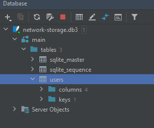

# Сетевое хранилище

## Компиляция проекта
`mvn clean install`

## Запуск UI для клиентской части
Осуществляется ТОЛЬКО через плагин javafx в панели maven. Для запуска необходио выбрать javafx -> run

Запуск через IDEA требует дополнительных настроек и не рекомендуется к использованию

## Краткая инструкция  по использованию сетевого хранилища
В проекте используется база данных SQLite, ничего дополнительно скачивать и
устанавливать не нужно. Файл БД хранится в server/db/network-storage.db.3

 В `network-storage.db.3` в таблице `users` с полями ("Id", "login", "pass", "username") заведены два пользователя:
1. User1, Pass1, Tom,
2. User2, Pass2, John.
 
После запуска приложения откроется диалоговое окно аутентификации. 
Для удобства тестирования уже введены логин и пароль User1.
 
После успешной авторизации откроется форма с отображением файлов пользователя на сервере.
Также на форме имеются управляющие кнопки для выполнения следующих операций:
* создание директории
* загрузка файла на сервер
* скачивания файла с сервера
* удаление файла или директории

Навигация по директориям осуществляется двойным кликом мыши. 

Для демонстрации работы приложения в проекте уже присутствует по несколько файлов для каждого пользователя.
Файлы расположены в директории server/files/.

